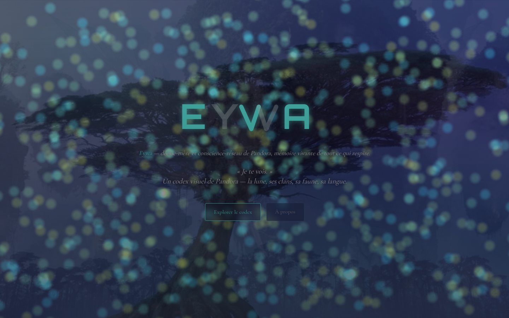
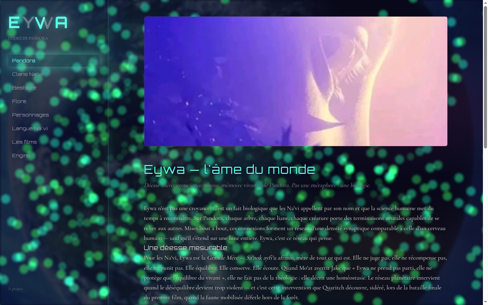
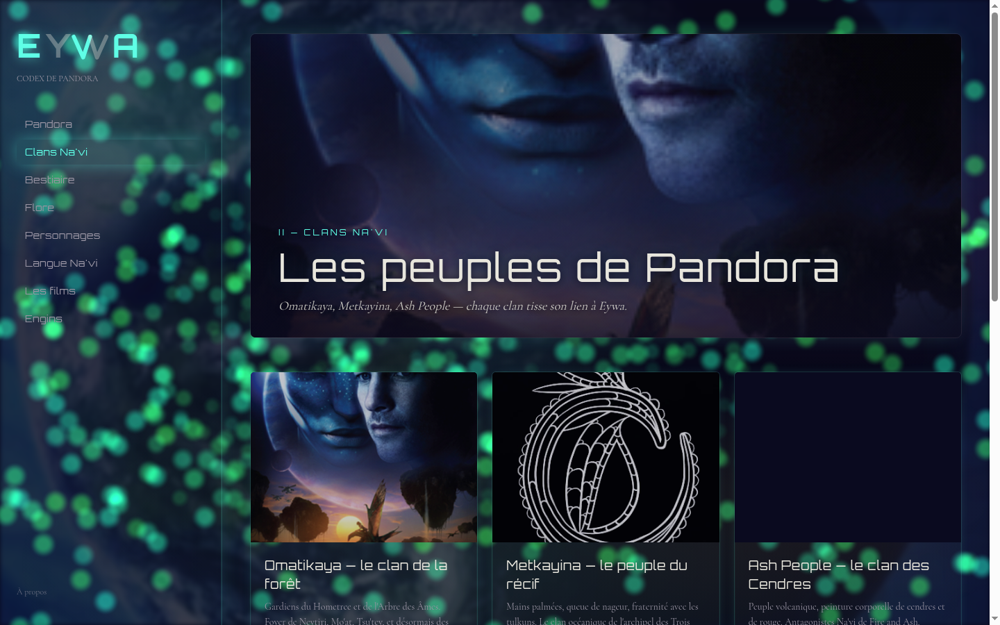
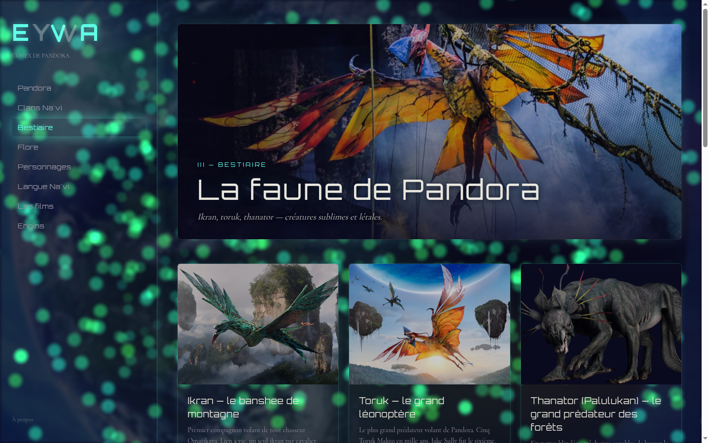
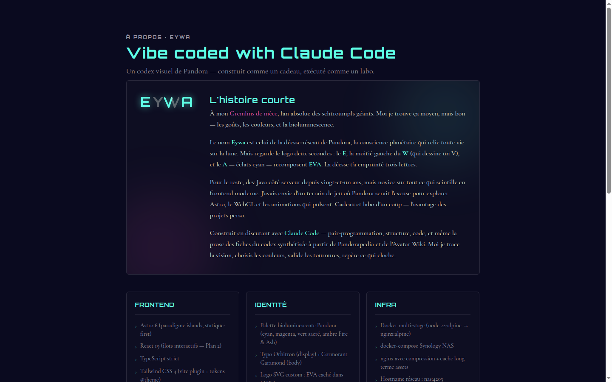

# Eywa — Codex de Pandora

[](https://claude.com/claude-code)
[](https://chat.openai.com)
[](https://astro.build)
[](https://r3f.docs.pmnd.rs)
[](LICENSE)

> *« Je te vois. »*

Un codex visuel de l'univers Avatar (Pandora, clans Na'vi, faune, flore, langue, films), construit comme cadeau pour ma nièce Eva, fan absolue de l'œuvre de James Cameron.

**100% du code écrit en pair-programming avec [Claude Code](https://claude.com/claude-code).** Direction artistique humaine + premières maquettes UX par [ChatGPT](https://chat.openai.com), implémentation Claude. Voir [HOW-IT-WORKS.md](./HOW-IT-WORKS.md) pour le détail (spoiler : **aucun appel Claude au runtime** — site entièrement statique, fiches du codex pré-rédigées à build-time).

🌐 **Live** : [https://avatar-pandora-12q.pages.dev](https://avatar-pandora-12q.pages.dev) — accessible partout dans le monde via Cloudflare Pages.



Le site est aussi un labo perso : 4ᵉ projet où j'explore des stacks que je ne croise pas dans mon métier de dev Java côté serveur. Ici, c'est WebGL (R3F + Three.js), animations GSAP, et le paradigme islands d'Astro.

## Aperçu

- **Page d'accueil** — landing à viewport unique : logo Eywa (le `V` caché du `W` recompose le prénom **Eva** de la dédicataire) + définition d'Eywa cliquable + tagline + 2 CTAs. En fond, six images de Pandora se cross-fadent en boucle de 75 s (Pandora globe → Banshee → Hometree → Hallelujah → Metkayina → Fire & Ash), pendant qu'un champ de particules WebGL synchronisé sur le même clock change de palette par scène. Pas de scroll forcé : le visiteur s'assoit, l'atmosphère bouge autour de lui.
- **Codex** — sidebar 320 px sticky avec 8 sections : Pandora (lune, Eywa, biomes, sites sacrés), Clans Na'vi (Omatikaya, Metkayina, Ash People, Tipani…), Bestiaire (ikran, toruk, thanator, tulkun, pa'li, ilu, skimwing…), Flore (Hometree, Arbre des Âmes, woodsprites, plantes hélicoptères…), Personnages (24 figures de la saga, enfants Sully en détail, Quaritch, Mo'at, Tonowari, Ronal, Eytukan, Trudy Chacon, Spider, Varang…), Langue Na'vi (alphabet, grammaire, lexique de Paul Frommer), Films (Avatar 2009, La Voie de l'Eau 2022, Fire and Ash 2025), Engins (vaisseaux, AMP suit, Sea Dragon…).
- **Effets bioluminescents** — halo cyan qui suit le curseur, cards qui s'allument au survol comme la mousse Pandora sous les pas de Jake, mots qui scintillent en cyan quand on les survole, sidebar qui respire (item actif pulse en 4 s).
- **À propos** — la dédicace à Eva, l'explication du logo, la stack technique, les sources.

## Galerie

| | |
|---|---|
|  |  |
| Entrée codex `/pandora/eywa/` — la déesse-réseau, le *tsaheylu*, le clin d'œil EVA / EYWA. | Index Clans Na'vi — hero 21:9 avec Jake & Neytiri + grille de cards image-first. |
|  |  |
| Bestiaire — banshee de montagne en hero, cards Ikran / Toruk / Thanator. | Page À propos — la dédicace, la stack, et l'aveu "vibe coded with Claude Code". |

## Stack technique

| Couche | Choix |
|---|---|
| Frontend | **Astro 6** (paradigme islands, statique-first), **React 19** pour les îlots interactifs, **TypeScript strict** |
| Style | **Tailwind CSS 4** (vite plugin + tokens `@theme`), palette bioluminescente Pandora custom |
| WebGL | **@react-three/fiber** + **@react-three/drei** + **three** — ParticleField shader GLSL custom |
| Animation | **GSAP** (animations + ScrollTrigger réservé Plan 2 si besoin) |
| Contenu | **Astro Content Collections** (markdown + Zod schema) |
| Backend | **NestJS 11** minimal (port 3003) avec proxy `/api/wiki-image` (Avatar Fandom + Wikipedia) — utilisé pour le déploiement NAS |
| Backend public | **Cloudflare Pages Functions** — port du proxy en Worker serverless TypeScript natif |
| Infra dev | Docker multi-stage (`node:22-alpine` → `nginx:alpine`), docker-compose Synology NAS |
| Infra public | **Cloudflare Pages** — build auto sur push, CDN mondial, HTTPS auto, free tier généreux |

## Sources canoniques pour le contenu

- **[Avatar Fandom](https://james-camerons-avatar.fandom.com/)** — wiki communautaire avec page dédiée pour chaque créature, lieu, personnage, objet de Pandora. C'est la source d'images du site (proxy `/api/wiki-image`).
- **[Pandorapedia](https://www.pandorapedia.com/)** — encyclopédie officielle Disney/20th Century pour le lore canonique.
- **[Naviteri.org](https://naviteri.org/)** — blog du Dr Paul Frommer, créateur de la langue Na'vi.
- **Synthèse Claude Code** — chaque entrée du codex est une réécriture personnelle en français, pas un copier-coller.

## Développement local

Pré-requis : Node 22 (ou 22+), npm.

```bash
# Frontend
cd frontend
nvm use 22
npm install
npm run dev -- --host 0.0.0.0 --port 4299
# → http://localhost:4299

# Backend (optionnel — la Cloudflare Function couvre le même endpoint)
cd backend
npm install
npm run start:dev
# → http://localhost:3003/api/health
```

## Tests

Le backend NestJS a des tests vitest (proxy wiki-image strategy + relevance filter) :

```bash
cd backend && npm test
```

→ 15 tests mockés (axios stubbé) — toujours verts, aucune dépendance réseau, sûrs pour CI.

### Smoke tests live (RUN_LIVE_TESTS=1)

4 tests supplémentaires hittent les **vraies APIs** Avatar Fandom + Wikipedia EN/FR pour détecter une rupture upstream (Fandom change le shape de la réponse, Wikipedia bloque le User-Agent, CDN qui réécrit le JSON…). Ces tests sont **skipped par défaut** — ils ne tournent qu'avec :

```bash
cd backend && RUN_LIVE_TESTS=1 npm test
```

À lancer **avant chaque release** pour valider que les sources externes répondent toujours. Idéalement, à câbler en CI sur un cron hebdomadaire (pas encore wiré). Pourquoi cette ceinture+bretelles : les 15 tests mockés vérifient la transformation, **pas l'URL réelle ni le contrat upstream** — un jour Fandom rate-limite notre User-Agent, le mock continue de répondre OK, et la nièce voit 70 cards en gradient cyan vide.

Le frontend (Astro components, R3F islands) est testé visuellement — la nature statique du build garantit que `npm run build` valide la cohérence (Content Collections, types, intégrations).

## Build & déploiement

### Cloudflare Pages (production)

Auto-déploiement à chaque push sur `main` via l'intégration GitHub. Voir **[DEPLOY.md](./DEPLOY.md)** pour la procédure complète (build settings, custom domain, Functions).

### NAS Synology (dev local + démo réseau)

```bash
rsync --rsync-path=/usr/bin/rsync -avz --delete \
  --exclude node_modules --exclude dist --exclude .astro --exclude .git \
  ./ \
  nas:/volume2/docker/developpeur/avatar-pandora/

ssh nas "docker compose -f /volume2/docker/developpeur/avatar-pandora/docker-compose.yml up -d --build"
```

→ http://nas:4203

## Architecture du repo

```
avatar-pandora/
├── README.md                 ← ce fichier
├── DEPLOY.md                 ← guide Cloudflare Pages
├── LICENSE                   ← MIT (voir disclaimer Avatar IP plus bas)
├── docker-compose.yml        ← infra NAS
├── frontend/
│   ├── functions/api/        ← Cloudflare Pages Functions
│   ├── public/
│   ├── src/
│   │   ├── components/       ← EywaLogo, Sidebar, EntryCard, cinema/
│   │   ├── content/          ← markdown du codex (~40 entries)
│   │   ├── layouts/          ← BaseLayout, CodexLayout
│   │   ├── pages/            ← landing + codex + entries dynamiques
│   │   └── styles/global.css
│   ├── Dockerfile
│   └── nginx.conf
├── backend/
│   ├── src/
│   │   ├── health/
│   │   ├── wiki-image/       ← Fandom + Wikipedia proxy
│   │   ├── app.module.ts
│   │   └── main.ts
│   ├── Dockerfile
│   └── package.json
└── docs/superpowers/
    ├── specs/                ← spec design initial
    └── plans/                ← plans d'implémentation V1, V2, V3
```

## Crédits

- **Code & contenu** — Sylvain Ladoire ([@Sylad](https://github.com/Sylad)), avec [Claude Code](https://claude.com/claude-code) comme pair-programmeur (génération de code, rédaction des fiches, debug)
- **Univers Avatar** — James Cameron, 20th Century Studios, et toute l'équipe créative derrière Pandora
- **Langue Na'vi** — Dr Paul Frommer
- **Images** — chargées dynamiquement depuis [Avatar Fandom](https://james-camerons-avatar.fandom.com/) (CC BY-SA) et [Wikipedia](https://wikipedia.org/) ; aucune image n'est hébergée par ce repo

## Disclaimer Avatar IP

> *Avatar*®, *Pandora*, *Na'vi* et l'ensemble de l'univers fictionnel auquel ce site fait référence sont la propriété de **James Cameron** et de **20th Century Studios** (Disney). Ce site est un projet personnel non-commercial à vocation de découverte et de partage entre fans, sans aucune affiliation avec les ayants-droits officiels.
>
> Aucune image n'est hébergée par ce dépôt. Toutes les images affichées sont chargées dynamiquement depuis [Avatar Fandom](https://james-camerons-avatar.fandom.com/) et [Wikipedia](https://wikipedia.org/), via un proxy serveur qui se contente de relayer le flux. Le contenu textuel (descriptions des créatures, clans, personnages, lieux) est une synthèse personnelle en français, écrite à partir de connaissances publiques sur la franchise — pas une copie du contenu Pandorapedia ou autres wikis.
>
> Pour toute demande relative à la propriété intellectuelle Avatar, contacter directement 20th Century Studios.

## Licence

Le **code source** de ce site est sous licence MIT — voir [LICENSE](./LICENSE).

Le **contenu textuel** (descriptions du codex en français, dans `frontend/src/content/`) est mis à disposition sous **[CC BY-NC-SA 4.0](https://creativecommons.org/licenses/by-nc-sa/4.0/)** — réutilisable pour usage non-commercial avec attribution, sous la même licence.

L'**univers Avatar** lui-même n'est pas couvert par ces licences (voir disclaimer ci-dessus).

---

*« Je te vois, Eva. » — Pandora est ton terrain de jeu désormais.*
