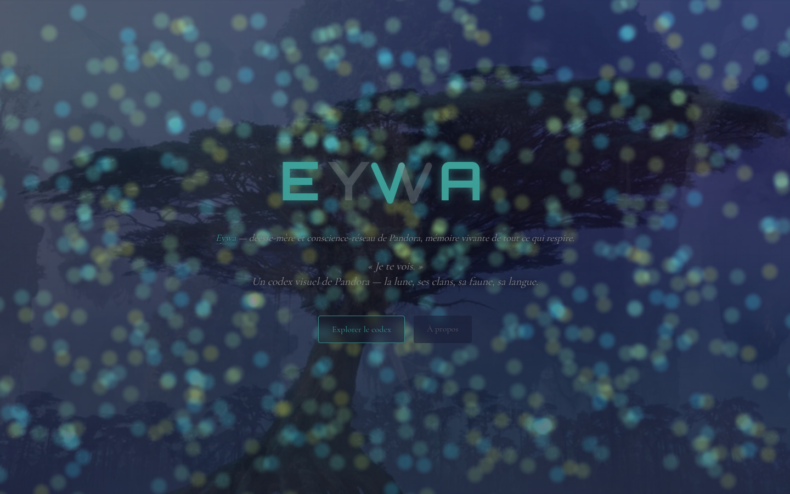
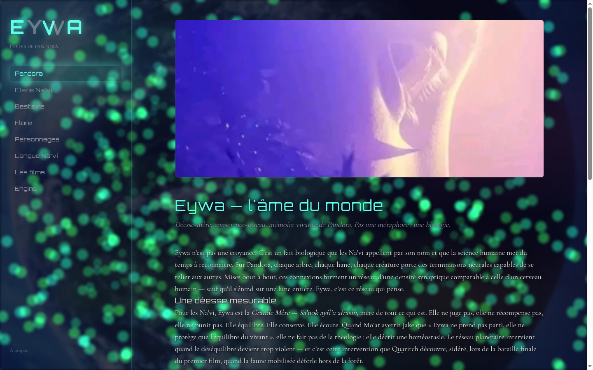
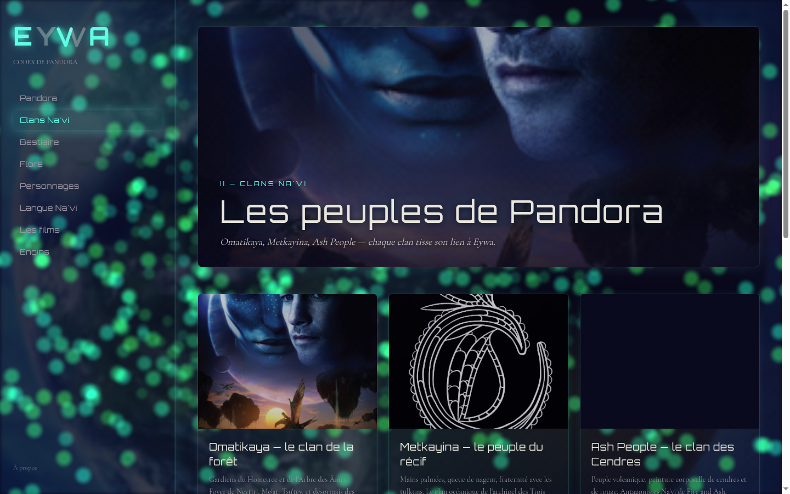
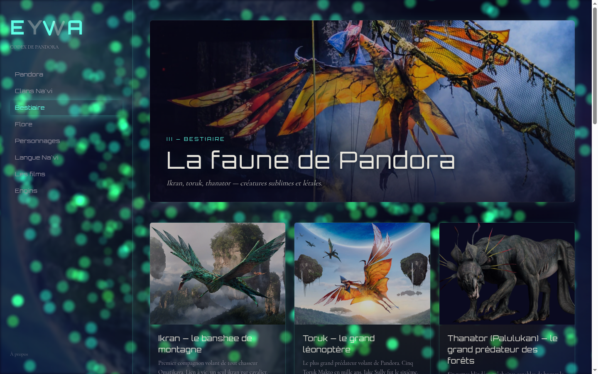
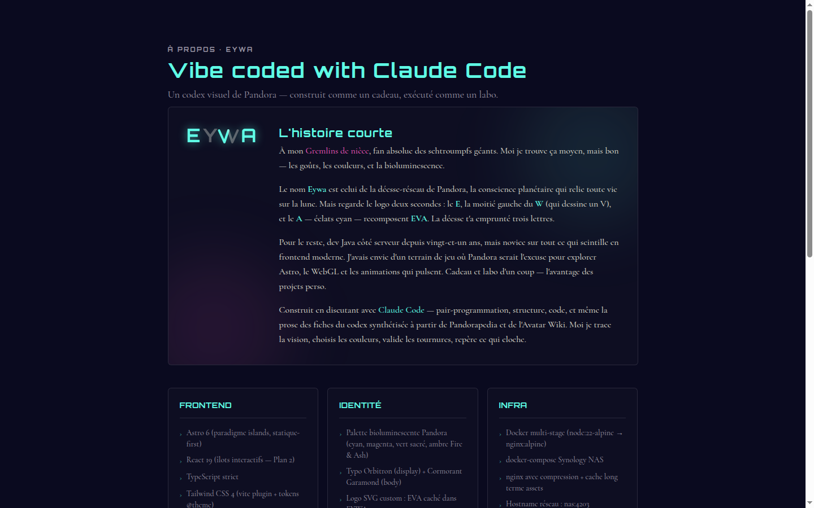

# Eywa — Codex de Pandora

[](https://claude.com/claude-code)
[](https://openai.com/codex)
[](https://astro.build)
[](https://r3f.docs.pmnd.rs)
[](LICENSE)

> *« Je te vois. »*

Un codex visuel de l'univers Avatar (Pandora, clans Na'vi, faune, flore, langue, films), construit comme cadeau pour ma nièce Eva, fan absolue de l'œuvre de James Cameron.

**Code et contenu construits en pair-programming avec [Claude Code](https://claude.com/claude-code), puis relus et ajustés avec Codex.** Direction artistique humaine, implémentation assistée, aucune IA au runtime. Voir [HOW-IT-WORKS.md](./HOW-IT-WORKS.md) pour le détail : site entièrement statique, fiches du codex pré-rédigées à build-time.

🌐 **Live** : [https://avatar-pandora-12q.pages.dev](https://avatar-pandora-12q.pages.dev) — accessible partout dans le monde via Cloudflare Pages.



Le site est aussi un labo perso : 4ᵉ projet où j'explore des stacks que je ne croise pas dans mon métier de dev Java côté serveur. Ici, c'est WebGL (R3F + Three.js), animations GSAP, et le paradigme islands d'Astro.

## Aperçu

- **Page d'accueil** — landing à viewport unique : logo Eywa (le `V` caché du `W` recompose le prénom **Eva** de la dédicataire) + définition d'Eywa cliquable + tagline + 2 CTAs, et dessous les liens **Nouveautés** (pastille des nouveautés non vues) et **Plan de travail**. En fond, six images de Pandora se cross-fadent en boucle de 75 s (Pandora globe → Banshee → Hometree → Hallelujah → Metkayina → Fire & Ash), pendant qu'un champ de particules WebGL synchronisé sur le même clock change de palette par scène. Pas de scroll forcé : le visiteur s'assoit, l'atmosphère bouge autour de lui.
- **Codex** — sidebar 320 px sticky avec 8 sections : Pandora (lune, Eywa, biomes, sites sacrés), Clans Na'vi (Omatikaya, Metkayina, Ash People, Tipani…), Bestiaire (ikran, toruk, thanator, tulkun, pa'li, ilu, skimwing…), Flore (Hometree, Arbre des Âmes, woodsprites, plantes hélicoptères…), Personnages (24 figures de la saga, enfants Sully en détail, Quaritch, Mo'at, Tonowari, Ronal, Eytukan, Trudy Chacon, Spider, Varang…), Langue Na'vi (alphabet, grammaire, lexique de Paul Frommer), Films (Avatar 2009, La Voie de l'Eau 2022, Fire and Ash 2025), Engins (vaisseaux, AMP suit, Sea Dragon…).
- **Effets bioluminescents** — halo cyan qui suit le curseur, cards qui s'allument au survol comme la mousse Pandora sous les pas de Jake, mots qui scintillent en cyan quand on les survole, sidebar qui respire (item actif pulse en 4 s).
- **À propos** — la dédicace à Eva, l'explication du logo, la stack technique, les sources.
- **Nouveautés** et **Plan de travail** — le journal de ce qui a changé, et ce qui est en cours, prévu et récemment livré (généré au build depuis le plan du projet, titres publics seulement).

## Galerie

| | |
|---|---|
|  |  |
| Entrée codex `/pandora/eywa/` — la déesse-réseau, le *tsaheylu*, le clin d'œil EVA / EYWA. | Index Clans Na'vi — hero 21:9 avec Jake & Neytiri + grille de cards image-first. |
|  |  |
| Bestiaire — banshee de montagne en hero, cards Ikran / Toruk / Thanator. | Page À propos — la dédicace, la stack, et l'aveu "vibe coded with Claude Code". |

## Stack technique

| Couche | Choix |
|---|---|
| Frontend | **Astro 6** (paradigme islands, statique-first), **React 19** pour les îlots interactifs, **TypeScript strict** |
| Style | **Tailwind CSS 4** (vite plugin + tokens `@theme`), palette bioluminescente Pandora custom |
| WebGL | **@react-three/fiber** + **@react-three/drei** + **three** — ParticleField shader GLSL custom |
| Animation | **GSAP** (animations + ScrollTrigger réservé Plan 2 si besoin) |
| Contenu | **Astro Content Collections** (markdown + Zod schema) |
| Backend | **Aucun** — site 100 % statique ; l'ancien proxy d'images Fandom (NestJS + Cloudflare Function) et le backend NestJS ont été retirés le 01-10-2026 |
| Dev local | `npm run dev` dans `frontend/` (Node 22) |
| Infra public | **Cloudflare Pages** — build auto sur push, CDN mondial, HTTPS auto, free tier généreux |

## Sources canoniques pour le contenu

- **[Avatar Fandom](https://james-camerons-avatar.fandom.com/)** — wiki communautaire avec page dédiée pour chaque créature, lieu, personnage, objet de Pandora. Source de texte ; ce n'est plus une source d'images (le proxy a été retiré le 01-10-2026, Fandom répondant par un défi anti-robot).
- **[Pandorapedia](https://www.pandorapedia.com/)** — encyclopédie officielle Disney/20th Century pour le lore canonique.
- **[Naviteri.org](https://naviteri.org/)** — blog du Dr Paul Frommer, créateur de la langue Na'vi.
- **Synthèse Claude Code** — chaque entrée du codex est une réécriture personnelle en français, pas un copier-coller.

## Développement local

Pré-requis : Node 22 (ou 22+), npm.

```bash
cd frontend
nvm use 22
npm install
npm run dev
# → http://localhost:4321
```

## Tests

Le site n'a plus de backend : c'est le build qui valide la cohérence (Content Collections + schéma Zod, types, intégrations Astro). Les pages Nouveautés et Plan de travail, la navigation et le menu du téléphone sont testés dans un navigateur sur le site construit (Node ≥ 22.18, Chromium via `playwright-core`).

```bash
cd frontend && npm run build   # 81 pages
npm run test:scripts           # node --test ../scripts/*.test.mjs
```

## Build & déploiement

### Cloudflare Pages (seule cible)

Auto-déploiement à chaque push sur `main` via l'intégration GitHub. Voir **[DEPLOY.md](./DEPLOY.md)** pour la procédure complète (build settings, custom domain).

Livraison : `cadence deliver` (voir `cadence.yaml`). Jusqu'au 01-10-2026, une copie tournait aussi sur un NAS Synology (Docker + nginx) ; elle a été retirée.

## Architecture du repo

```
avatar-pandora/
├── README.md                 ← ce fichier
├── DEPLOY.md                 ← guide Cloudflare Pages
├── LICENSE                   ← MIT (voir disclaimer Avatar IP plus bas)
├── frontend/
│   ├── public/
│   ├── src/
│   │   ├── components/       ← EywaLogo, Sidebar, EntryCard, cinema/
│   │   ├── content/          ← markdown du codex (~40 entries)
│   │   ├── layouts/          ← BaseLayout, CodexLayout
│   │   ├── pages/            ← landing + codex + entries dynamiques
│   │   └── styles/global.css
└── docs/superpowers/
    ├── specs/                ← spec design initial
    └── plans/                ← plans d'implémentation V1, V2, V3
```

## Crédits

- **Code & contenu** — Sylvain Ladoire ([@Sylad](https://github.com/Sylad)), avec [Claude Code](https://claude.com/claude-code) comme pair-programmeur principal, puis Codex pour la relecture, les corrections ciblées et les itérations
- **Univers Avatar** — James Cameron, 20th Century Studios, et toute l'équipe créative derrière Pandora
- **Langue Na'vi** — Dr Paul Frommer
- **Images** — aucune image tierce : les fiches affichent un visuel par défaut aux couleurs d'Eywa, en attendant des illustrations propres hébergées sur le site

## Disclaimer Avatar IP

> *Avatar*®, *Pandora*, *Na'vi* et l'ensemble de l'univers fictionnel auquel ce site fait référence sont la propriété de **James Cameron** et de **20th Century Studios** (Disney). Ce site est un projet personnel non-commercial à vocation de découverte et de partage entre fans, sans aucune affiliation avec les ayants-droits officiels.
>
> Aucune image tierce n'est affichée ni hébergée : ni capture des films, ni image de wiki. Le contenu textuel (descriptions des créatures, clans, personnages, lieux) est une synthèse personnelle en français, écrite à partir de connaissances publiques sur la franchise — pas une copie du contenu Pandorapedia ou autres wikis.
>
> Pour toute demande relative à la propriété intellectuelle Avatar, contacter directement 20th Century Studios.

## Licence

Le **code source** de ce site est sous licence MIT — voir [LICENSE](./LICENSE).

Le **contenu textuel** (descriptions du codex en français, dans `frontend/src/content/`) est mis à disposition sous **[CC BY-NC-SA 4.0](https://creativecommons.org/licenses/by-nc-sa/4.0/)** — réutilisable pour usage non-commercial avec attribution, sous la même licence.

L'**univers Avatar** lui-même n'est pas couvert par ces licences (voir disclaimer ci-dessus).

---

*« Je te vois, Eva. » — Pandora est ton terrain de jeu désormais.*
